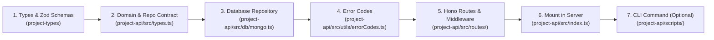

# 🚀 API Feature Implementation Workflow

This skill documents the end-to-end standard for building and integrating new backend features into the `project-api`, `project-types`, and CLI layers of this fullstack template.

---

## 🏗️ Architecture Flow



---

## Step 1: Define Schemas in `project-types`

All shared schemas and TypeScript types must be defined in [project-types/src/index.ts](file:///c:/Users/Dell/Desktop/template/project-types/src/index.ts).

### Pattern:
```ts
import { z } from "zod";

export const ItemSchema = z.object({
  _id: IdSchema,
  userId: IdSchema,
  title: z.string().min(1).max(200),
  description: z.string().max(2000).optional(),
  status: z.enum(["pending", "active", "completed"]).default("pending"),
  amount: z.number().nonnegative().optional(),
  createdAt: z.string(),
  updatedAt: z.string(),
});

export type Item = z.infer<typeof ItemSchema>;

export const CreateItemInputSchema = ItemSchema.omit({
  _id: true,
  createdAt: true,
  updatedAt: true,
});
export type CreateItemInput = z.infer<typeof CreateItemInputSchema>;
```

---

## Step 2: Define Repository Contract in `project-api/src/types.ts`

Update [project-api/src/types.ts](file:///c:/Users/Dell/Desktop/template/project-api/src/types.ts) to declare the domain model interface and repository signature.

### 1. Add Domain Interface:
```ts
export interface Item {
  _id: Id;
  userId: Id;
  title: string;
  description?: string;
  status: "pending" | "active" | "completed";
  amount?: number;
  createdAt: Date;
  updatedAt: Date;
}
```

### 2. Add to `Repositories` Interface:
```ts
export interface Repositories {
  // ... existing repos
  items: {
    create(data: Omit<Item, "_id" | "createdAt" | "updatedAt">): Promise<Item>;
    findById(id: Id): Promise<Item | null>;
    findByUserId(userId: Id, options?: { limit?: number; offset?: number }): Promise<{ items: Item[]; total: number }>;
    update(id: Id, patch: Partial<Omit<Item, "_id" | "userId" | "createdAt">>): Promise<Item | null>;
    delete(id: Id): Promise<boolean>;
  };
}
```

---

## Step 3: Implement MongoDB Repository in `project-api/src/db/mongo.ts`

Implement the repository using MongoDB native driver in [project-api/src/db/mongo.ts](file:///c:/Users/Dell/Desktop/template/project-api/src/db/mongo.ts).

### 1. Define Internal Mongo Model:
```ts
interface MongoItem extends Omit<Item, "_id" | "userId"> {
  _id: ObjectId;
  userId: ObjectId;
}
```

### 2. Add Collection & Indexing in `createMongoRepositories`:
```ts
const itemsCol = db.collection<MongoItem>("items");

// Ensure proper indexing
await itemsCol.createIndex({ userId: 1, createdAt: -1 });
```

### 3. Implement Methods & Mapping:
```ts
function mapItem(doc: WithId<MongoItem>): Item {
  const { _id, userId, ...rest } = doc;
  return {
    _id: _id.toHexString(),
    userId: userId.toHexString(),
    ...rest,
  };
}

const itemsRepo: Repositories["items"] = {
  async create(data) {
    const now = new Date();
    const doc: MongoItem = {
      _id: new ObjectId(),
      userId: toId(data.userId),
      title: data.title,
      description: data.description,
      status: data.status,
      amount: data.amount,
      createdAt: now,
      updatedAt: now,
    };
    await itemsCol.insertOne(doc);
    return mapItem(doc as WithId<MongoItem>);
  },

  async findById(id) {
    if (!isValidObjectId(id)) return null;
    const doc = await itemsCol.findOne({ _id: toId(id) });
    return doc ? mapItem(doc) : null;
  },

  async findByUserId(userId, options) {
    if (!isValidObjectId(userId)) return { items: [], total: 0 };
    const filter = { userId: toId(userId) };
    const limit = options?.limit ?? 50;
    const offset = options?.offset ?? 0;

    const [items, total] = await Promise.all([
      itemsCol.find(filter).sort({ createdAt: -1 }).skip(offset).limit(limit).toArray(),
      itemsCol.countDocuments(filter),
    ]);

    return {
      items: items.map(mapItem),
      total,
    };
  },

  async update(id, patch) {
    if (!isValidObjectId(id)) return null;
    const updateDoc: Partial<MongoItem> & { updatedAt: Date } = {
      ...patch,
      updatedAt: new Date(),
    };
    const res = await itemsCol.findOneAndUpdate(
      { _id: toId(id) },
      { $set: updateDoc },
      { returnDocument: "after" }
    );
    return res ? mapItem(res) : null;
  },

  async delete(id) {
    if (!isValidObjectId(id)) return false;
    const res = await itemsCol.deleteOne({ _id: toId(id) });
    return res.deletedCount > 0;
  },
};
```

---

## Step 4: Register Error Codes in `project-api/src/utils/errorCodes.ts`

Add domain-specific error codes in [project-api/src/utils/errorCodes.ts](file:///c:/Users/Dell/Desktop/template/project-api/src/utils/errorCodes.ts):

```ts
export const ErrorCode = {
  // ... existing error codes
  ITEM_NOT_FOUND: "item_not_found",
  CREATE_ITEM_FAILED: "item_create_failed",
  UPDATE_ITEM_FAILED: "item_update_failed",
  DELETE_ITEM_FAILED: "item_delete_failed",
  FETCH_ITEM_FAILED: "item_fetch_failed",
} as const;
```

---

## Step 5: Create Hono Route Controller

Create a new route file, e.g., `project-api/src/routes/items.ts`:

```ts
import { Hono } from "hono";
import { z } from "zod";
import type { Repositories, Id } from "../types";
import { requireAuth, type AppEnv } from "../middleware/auth";
import { AppError } from "../utils/AppError";
import { ErrorCode } from "../utils/errorCodes";
import { wsServer } from "../websocket";

const createItemBodySchema = z.object({
  title: z.string().min(1).max(200),
  description: z.string().max(2000).optional(),
  amount: z.number().nonnegative().optional(),
});

const updateItemBodySchema = z.object({
  title: z.string().min(1).max(200).optional(),
  description: z.string().max(2000).optional(),
  status: z.enum(["pending", "active", "completed"]).optional(),
  amount: z.number().nonnegative().optional(),
});

export function createItemsRoutes(repos: Repositories) {
  const app = new Hono<AppEnv>();

  // Enforce authentication on all item routes
  app.use("*", requireAuth(repos));

  // List items for authenticated user
  app.get("/", async (c) => {
    try {
      const userId = c.get("auth").user._id;
      const limit = c.req.query("limit") ? parseInt(c.req.query("limit")!) : 50;
      const offset = c.req.query("offset") ? parseInt(c.req.query("offset")!) : 0;

      const result = await repos.items.findByUserId(userId, { limit, offset });
      return c.json(result);
    } catch (error) {
      if (error instanceof AppError) throw error;
      throw new AppError(ErrorCode.FETCH_ITEM_FAILED, 500);
    }
  });

  // Get item by ID
  app.get("/:id", async (c) => {
    const itemId = c.req.param("id") as Id;
    const userId = c.get("auth").user._id;

    const item = await repos.items.findById(itemId);
    if (!item || item.userId !== userId) {
      throw new AppError(ErrorCode.ITEM_NOT_FOUND, 404);
    }

    return c.json(item);
  });

  // Create new item
  app.post("/", async (c) => {
    const userId = c.get("auth").user._id;
    const body = await c.req.json().catch(() => ({}));
    const parsed = createItemBodySchema.safeParse(body);

    if (!parsed.success) {
      throw new AppError(ErrorCode.VALIDATION, 400);
    }

    const newItem = await repos.items.create({
      userId,
      title: parsed.data.title,
      description: parsed.data.description,
      status: "pending",
      amount: parsed.data.amount,
    });

    // Optional: Realtime WebSocket notification
    wsServer.sendToUser(userId, {
      type: "item_created",
      payload: newItem,
    });

    return c.json(newItem, 201);
  });

  // Update item
  app.patch("/:id", async (c) => {
    const itemId = c.req.param("id") as Id;
    const userId = c.get("auth").user._id;

    const existing = await repos.items.findById(itemId);
    if (!existing || existing.userId !== userId) {
      throw new AppError(ErrorCode.ITEM_NOT_FOUND, 404);
    }

    const body = await c.req.json().catch(() => ({}));
    const parsed = updateItemBodySchema.safeParse(body);

    if (!parsed.success) {
      throw new AppError(ErrorCode.VALIDATION, 400);
    }

    const updated = await repos.items.update(itemId, parsed.data);
    return c.json(updated);
  });

  // Delete item
  app.delete("/:id", async (c) => {
    const itemId = c.req.param("id") as Id;
    const userId = c.get("auth").user._id;

    const existing = await repos.items.findById(itemId);
    if (!existing || existing.userId !== userId) {
      throw new AppError(ErrorCode.ITEM_NOT_FOUND, 404);
    }

    const success = await repos.items.delete(itemId);
    if (!success) {
      throw new AppError(ErrorCode.DELETE_ITEM_FAILED, 500);
    }

    return c.json({ success: true });
  });

  return app;
}
```

---

## Step 6: Mount Route in `project-api/src/index.ts`

Mount the route under the configured API version prefix in [project-api/src/index.ts](file:///c:/Users/Dell/Desktop/template/project-api/src/index.ts):

```ts
import { createItemsRoutes } from "./routes/items";

// Inside the server initialization:
const apiVersion = process.env.VITE_API_VERSION || "v1";
app.route(`/api/${apiVersion}/items`, createItemsRoutes(repos));
```

---

## Step 7: (Optional) Register Administrative CLI Command

If the feature needs administrative management via the CLI in [project-api/scripts/commands/](file:///c:/Users/Dell/Desktop/template/project-api/scripts/commands/):

```ts
import { api, question, select } from "../utils";

export const manageItems = async () => {
  const action = await select("Select action:", [
    { label: "List Items", value: "list" },
    { label: "Create Item", value: "create" },
    { label: "Back", value: "back" },
  ]);

  if (action === "list") {
    const res = await api.get<{ items: any[]; total: number }>("/items");
    console.table(res.items);
  } else if (action === "create") {
    const title = await question("Item title: ");
    const res = await api.post("/items", { title });
    console.log("✅ Created item:", res);
  }
};
```

---

## 📋 Feature Implementation Checklist

- [ ] **Types**: Defined Zod schema & exported inferred TypeScript types in `project-types`.
- [ ] **Contract**: Added domain interface & repository signatures in `project-api/src/types.ts`.
- [ ] **Database**: Implemented MongoDB collection methods, indexes, and mapping in `project-api/src/db/mongo.ts`.
- [ ] **Errors**: Added relevant error codes to `project-api/src/utils/errorCodes.ts`.
- [ ] **Security**: Applied `requireAuth`, `requirePermission`, or `auditLog` where appropriate.
- [ ] **Sanitization**: Ensured user input and object IDs are validated (`isValidObjectId`, `toId`).
- [ ] **Mounting**: Registered route in `project-api/src/index.ts` under `/api/${apiVersion}/...`.
- [ ] **Realtime**: Added WebSocket triggers if state needs to sync to connected frontend clients.
