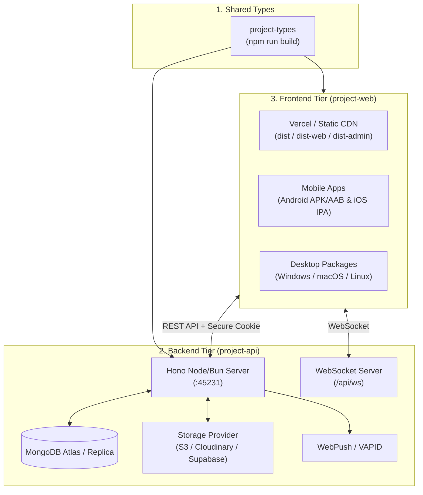

# 🚀 Fullstack Application Deployment Workflow

This skill documents the complete, production-grade deployment standards and step-by-step instructions for deploying all tiers of this fullstack template: **`project-types`**, **`project-api`** (Hono + MongoDB + WebSockets), **`project-web`** (Vite + React SPA / Admin / Web modes), **Mobile apps** (Capacitor Android/iOS), and **Desktop apps** (Electron).

---

## 📑 Table of Contents
1. [Deployment Architecture](#1-deployment-architecture)
2. [Pre-Deployment Checklist](#2-pre-deployment-checklist)
3. [Shared Types Build (`project-types`)](#3-shared-types-build-project-types)
4. [Backend API Deployment (`project-api`)](#4-backend-api-deployment-project-api)
   - [Option A: Docker & Container Platforms (Railway, Fly.io, Render, DigitalOcean)](#option-a-docker--container-platforms)
   - [Option B: Bare-Metal / VPS with PM2 or Systemd](#option-b-bare-metal--vps-with-pm2-or-systemd)
   - [Option C: Database & Cloud Services (MongoDB Atlas, S3, Push)](#option-c-database--cloud-services)
5. [Frontend Deployment (`project-web`)](#5-frontend-deployment-project-web)
   - [Option A: Vercel / Netlify / Cloudflare Pages](#option-a-vercel--netlify--cloudflare-pages)
   - [Option B: Nginx Static Server on VPS](#option-b-nginx-static-server-on-vps)
   - [Building Separate Targets (App, Web Landing, Admin)](#building-separate-targets)
6. [Mobile App Releases (Capacitor)](#6-mobile-app-releases-capacitor)
7. [Desktop App Releases (Electron)](#7-desktop-app-releases-electron)
8. [Security & Production Hardening](#8-security--production-hardening)
9. [Deployment Verification & Smoke Testing](#9-deployment-verification--smoke-testing)

---

## 1. Deployment Architecture



---

## 2. Pre-Deployment Checklist

Before deploying any component, execute these validation steps locally or in CI:

```bash
# 1. Build and verify shared types
cd project-types
npm run build

# 2. Verify backend TypeScript compilation & linting
cd ../project-api
npm run check
npm run lint

# 3. Verify frontend TypeScript compilation & build
cd ../project-web
npm run check
npm run lint
npm run build
```

---

## 3. Shared Types Build (`project-types`)

`project-types` must be compiled first because both frontend and backend link to it:

```bash
cd project-types
npm install
npm run build
```

The output `dist/` contains:
- `dist/index.js`
- `dist/index.d.ts`

---

## 4. Backend API Deployment (`project-api`)

### Option A: Docker & Container Platforms

Use the production multi-stage Docker build for **Docker Compose, Railway, Render, Fly.io, or AWS ECS**:

```dockerfile
# project-api/Dockerfile.production
FROM oven/bun:1 AS builder
WORKDIR /app

# Build types first
COPY project-types ./project-types
WORKDIR /app/project-types
RUN bun install && bun run build

# Build API
WORKDIR /app/project-api
COPY project-api/package*.json project-api/bun.lock* ./
RUN bun install --frozen-lockfile
COPY project-api ./
RUN bun run build.api

# Production Runner
FROM oven/bun:1-slim AS runner
WORKDIR /app
ENV NODE_ENV=production
ENV PORT=45231

COPY --from=builder /app/project-types/dist ./project-types/dist
COPY --from=builder /app/project-types/package.json ./project-types/package.json
COPY --from=builder /app/project-api/node_modules ./project-api/node_modules
COPY --from=builder /app/project-api/dist ./project-api/dist
COPY --from=builder /app/project-api/package.json ./project-api/package.json

WORKDIR /app/project-api
EXPOSE 45231

CMD ["bun", "dist/index.js"]
```

#### Production `docker-compose.yml`
```yaml
version: '3.8'

services:
  api:
    build:
      context: .
      dockerfile: project-api/Dockerfile.production
    restart: always
    ports:
      - "45231:45231"
    environment:
      - ENV=production
      - API_PORT=45231
      - CORS_ORIGIN=https://your-domain.com,https://admin.your-domain.com
      - MONGODB_URI=mongodb+srv://<user>:<password>@cluster.mongodb.net/production_db?retryWrites=true&w=majority
      - JWT_SECRET=${JWT_SECRET}
      - ENCRYPTION_KEY=${ENCRYPTION_KEY}
      - STORAGE_PROVIDER=s3 # or cloudinary/supabase
      - SMS_PROVIDER=twilio # or plivo/clicksend
    depends_on:
      - mongo

  mongo:
    image: mongo:7
    restart: always
    volumes:
      - mongo-data:/data/db
    ports:
      - "27017:27017"

volumes:
  mongo-data:
```

---

### Option B: Bare-Metal / VPS with PM2 or Systemd

#### 1. Compile API on the Server
```bash
cd project-types && npm install && npm run build
cd ../project-api && npm install && npm run build.api
```

#### 2. Configure PM2 (`project-api/ecosystem.config.js`)
```javascript
module.exports = {
  apps: [
    {
      name: "template-api",
      script: "dist/index.js",
      cwd: "/var/www/app/project-api",
      instances: "max",
      exec_mode: "cluster",
      env_production: {
        NODE_ENV: "production",
        ENV: "production",
        API_PORT: 45231,
      },
    },
  ],
};
```

#### 3. Start & Enable PM2
```bash
pm2 start ecosystem.config.js --env production
pm2 save
pm2 startup
```

---

### Option C: Database & Cloud Services

Ensure the following environment variables are set in production `.env`:

| Variable | Description | Example / Requirement |
| :--- | :--- | :--- |
| `ENV` | Environment mode | `production` |
| `API_PORT` | HTTP Port | `45231` (or provider `$PORT`) |
| `CORS_ORIGIN` | Allowed web origins | `https://app.example.com,https://admin.example.com` |
| `MONGODB_URI` | Mongo Connection String | `mongodb+srv://...` |
| `MONGODB_DB` | Database Name | `app_prod` |
| `JWT_SECRET` | 32+ character high-entropy key | Generate via `openssl rand -hex 32` |
| `ENCRYPTION_KEY` | 64-char hex key for AES-256 | Generate via `openssl rand -hex 32` |
| `VAPID_PUBLIC_KEY` | Web Push Public Key | Run `npm run generate-vapid` |
| `VAPID_PRIVATE_KEY`| Web Push Private Key | Run `npm run generate-vapid` |
| `STORAGE_PROVIDER` | `s3`, `cloudinary`, `supabase` | Required for multi-instance |

---

## 5. Frontend Deployment (`project-web`)

### Building Separate Targets

The frontend repository supports 3 builds from the same codebase:

```bash
cd project-web

# 1. Main Client App (Output: dist/)
npm run build

# 2. Web / Landing Page (Output: dist-web/)
npm run build.web

# 3. Admin Dashboard (Output: dist-admin/)
npm run build.admin
```

---

### Option A: Vercel / Netlify / Cloudflare Pages

#### 1. Vercel Configuration (`project-web/vercel.json`)
```json
{
  "version": 2,
  "rewrites": [
    {
      "source": "/api/(.*)",
      "destination": "https://api.yourdomain.com/api/$1"
    },
    {
      "source": "/(.*)",
      "destination": "/index.html"
    }
  ]
}
```

#### 2. Vercel Project Settings
- **Framework Preset**: Vite
- **Root Directory**: `project-web`
- **Build Command**: `npm run build` (or `npm run build.admin` for admin site)
- **Output Directory**: `dist` (or `dist-admin` / `dist-web`)
- **Environment Variables**:
  - `VITE_API_URL`: `https://api.yourdomain.com/api`

---

### Option B: Nginx Static Server on VPS

```nginx
# /etc/nginx/sites-available/app.conf

# 1. Frontend App
server {
    listen 443 ssl http2;
    server_name app.yourdomain.com;

    ssl_certificate /etc/letsencrypt/live/app.yourdomain.com/fullchain.pem;
    ssl_certificate_key /etc/letsencrypt/live/app.yourdomain.com/privkey.pem;

    root /var/www/app/project-web/dist;
    index index.html;

    # Gzip Compression
    gzip on;
    gzip_types text/plain text/css application/json application/javascript text/xml application/xml application/xml+rss text/javascript image/svg+xml;

    location / {
        try_files $uri $uri/ /index.html;
    }

    # Static Assets Caching
    location /assets/ {
        expires 1y;
        add_header Cache-Control "public, immutable";
    }
}

# 2. Backend API Reverse Proxy & WebSocket
server {
    listen 443 ssl http2;
    server_name api.yourdomain.com;

    ssl_certificate /etc/letsencrypt/live/api.yourdomain.com/fullchain.pem;
    ssl_certificate_key /etc/letsencrypt/live/api.yourdomain.com/privkey.pem;

    location / {
        proxy_pass http://127.0.0.1:45231;
        proxy_http_version 1.1;
        proxy_set_header Upgrade $http_upgrade;
        proxy_set_header Connection "upgrade";
        proxy_set_header Host $host;
        proxy_set_header X-Real-IP $remote_addr;
        proxy_set_header X-Forwarded-For $proxy_add_x_forwarded_for;
        proxy_set_header X-Forwarded-Proto $scheme;
        proxy_read_timeout 86400s;
        proxy_send_timeout 86400s;
    }
}
```

---

## 6. Mobile App Releases (Capacitor)

### Android Release Pipeline
```bash
cd project-web

# 1. Build web bundle and sync assets
npm run build
npx cap sync android

# 2. Generate icons and splash screens
npm run cap.assets

# 3. Build release APK/AAB via Gradle
cd android
./gradlew bundleRelease  # Generates Play Store AAB
./gradlew assembleRelease # Generates direct APK
```
*Output path*: `android/app/build/outputs/bundle/release/app-release.aab`

### iOS Release Pipeline
```bash
cd project-web

# 1. Build and sync
npm run build
npx cap sync ios

# 2. Open Xcode to sign and archive
npx cap open ios
```
*In Xcode*: Select target -> `Product` -> `Archive` -> `Distribute App` to TestFlight or App Store Connect.

---

## 7. Desktop App Releases (Electron)

```bash
cd project-web

# Build Electron production bundles
npm run electron
```

For packaging multi-platform binaries, use `electron-builder`:
```bash
npx electron-builder --win --x64    # Windows installer (.exe)
npx electron-builder --mac --universal # macOS DMG (.dmg)
npx electron-builder --linux AppImage  # Linux AppImage
```

---

## 8. Security & Production Hardening

- [ ] **Enforce HTTPS**: Ensure all endpoints (API, Web, WS) operate over TLS/SSL.
- [ ] **Strict CORS Whitelist**: Set `CORS_ORIGIN` to exact production domains without wildcards.
- [ ] **Secure Cookies**: Ensure cookie `secure: true`, `httpOnly: true`, and `sameSite: "lax" | "strict"`.
- [ ] **Rate Limiting**: Confirm `RATE_LIMIT_GENERAL` and `RATE_LIMIT_AUTH` are enabled in production mode.
- [ ] **Environment Secrets**: Never commit `.env` or production credentials to Git. Use secret managers or CI/CD environment secrets.
- [ ] **MongoDB Access**: Restrict MongoDB Atlas network access to the API server's static IP or VPC peering.

---

## 9. Deployment Verification & Smoke Testing

Run the following checks once deployed:

```bash
# 1. Check API health & configuration
curl -I https://api.yourdomain.com/api/auth/me

# 2. Test WebSocket connection
wscat -c wss://api.yourdomain.com/api/ws

# 3. Verify Frontend index & SPA fallback
curl -s https://app.yourdomain.com/login | grep -q "html" && echo "✅ Web App OK"
```
