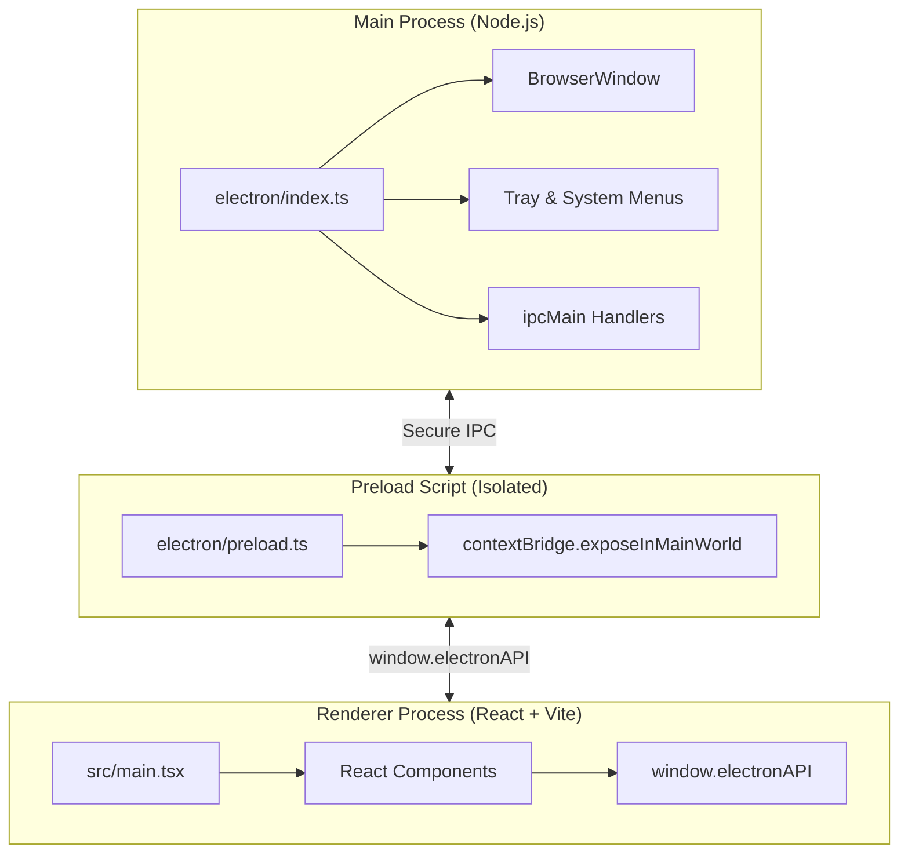

# 🖥️ Electron Desktop Application Workflow

This skill documents the complete development, security hardening, IPC architecture, and packaging standard for running `project-web` as a native desktop application using Electron and Vite.

---

## 📑 Table of Contents
1. [Architecture Overview](#1-architecture-overview)
2. [Main & Preload Process Structure](#2-main--preload-process-structure)
3. [Security Hardening Guidelines](#3-security-hardening-guidelines)
4. [Type-Safe IPC Communication](#4-type-safe-ipc-communication)
5. [Window Controls & Native Features](#5-window-controls--native-features)
6. [System Tray & Native Menus](#6-system-tray--native-menus)
7. [Packaging & Distribution](#7-packaging--distribution)
8. [Desktop Development Checklist](#8-desktop-development-checklist)

---

## 1. Architecture Overview



---

## 2. Main & Preload Process Structure

### 📁 Directory Layout
```
project-web/
├── electron/
│   ├── index.ts        # Main process entry (window lifecycle, IPC handlers)
│   ├── preload.ts      # Context bridge (secure API exposure)
│   └── tray.ts         # System tray icon and context menu
├── src/                # React Renderer code
└── vite.config.ts      # Configured with vite-plugin-electron
```

### 1. Main Process (`project-web/electron/index.ts`)
```ts
import { app, BrowserWindow, shell, ipcMain } from "electron";
import path from "node:path";

process.env.DIST_ELECTRON = path.join(__dirname, "..");
process.env.DIST = path.join(process.env.DIST_ELECTRON, "dist");
process.env.PUBLIC = process.env.VITE_DEV_SERVER_URL
  ? path.join(process.env.DIST_ELECTRON, "public")
  : process.env.DIST;

let mainWindow: BrowserWindow | null = null;
const preload = path.join(__dirname, "preload.js");
const url = process.env.VITE_DEV_SERVER_URL;
const indexHtml = path.join(process.env.DIST, "index.html");

async function createWindow() {
  mainWindow = new BrowserWindow({
    title: "App",
    icon: path.join(process.env.PUBLIC, "logo.png"),
    width: 1200,
    height: 800,
    minWidth: 900,
    minHeight: 600,
    webPreferences: {
      preload,
      nodeIntegration: false,
      contextIsolation: true,
      sandbox: true,
      webSecurity: true,
    },
  });

  // Security: Prevent navigation away from the app
  mainWindow.webContents.on("will-navigate", (event, navigationUrl) => {
    const parsedUrl = new URL(navigationUrl);
    if (parsedUrl.origin !== url && !navigationUrl.startsWith("file://")) {
      event.preventDefault();
      shell.openExternal(navigationUrl);
    }
  });

  // Security: Open external links in user's default browser
  mainWindow.webContents.setWindowOpenHandler(({ url: targetUrl }) => {
    if (targetUrl.startsWith("https:") || targetUrl.startsWith("http:")) {
      shell.openExternal(targetUrl);
    }
    return { action: "deny" };
  });

  if (url) {
    await mainWindow.loadURL(url);
    mainWindow.webContents.openDevTools();
  } else {
    await mainWindow.loadFile(indexHtml);
  }
}

app.whenReady().then(createWindow);

app.on("window-all-closed", () => {
  if (process.platform !== "darwin") {
    app.quit();
    mainWindow = null;
  }
});

app.on("activate", () => {
  if (BrowserWindow.getAllWindows().length === 0) {
    createWindow();
  }
});
```

### 2. Preload Script (`project-web/electron/preload.ts`)
```ts
import { contextBridge, ipcRenderer } from "electron";

export interface ElectronAPI {
  minimize: () => Promise<void>;
  maximize: () => Promise<void>;
  close: () => Promise<void>;
  getAppVersion: () => Promise<string>;
  openExternalUrl: (url: string) => Promise<void>;
}

const api: ElectronAPI = {
  minimize: () => ipcRenderer.invoke("window:minimize"),
  maximize: () => ipcRenderer.invoke("window:maximize"),
  close: () => ipcRenderer.invoke("window:close"),
  getAppVersion: () => ipcRenderer.invoke("app:getVersion"),
  openExternalUrl: (url: string) => ipcRenderer.invoke("shell:openExternal", url),
};

contextBridge.exposeInMainWorld("electronAPI", api);
```

### 3. Global Type Declarations (`project-web/src/vite-env.d.ts` or `src/types/electron.d.ts`)
```ts
import type { ElectronAPI } from "../electron/preload";

declare global {
  interface Window {
    electronAPI?: ElectronAPI;
  }
}
```

---

## 3. Security Hardening Guidelines

Always enforce the following rules in the main process and renderer:

| Security Rule | Configuration | Rationale |
| :--- | :--- | :--- |
| **Context Isolation** | `contextIsolation: true` | Prevents scripts in renderer from accessing Electron internals. |
| **Disable Node Integration** | `nodeIntegration: false` | Stops remote code execution vulnerabilities via malicious payload. |
| **Enable Sandbox** | `sandbox: true` | Enforces OS-level sandbox on the renderer process. |
| **Web Security** | `webSecurity: true` | Ensures same-origin policy is enforced for all web requests. |
| **Navigation Restrictions** | `webContents.on("will-navigate")` | Prevents accidental navigation to untrusted third-party URLs. |
| **Window Open Restrictions** | `webContents.setWindowOpenHandler` | Blocks `window.open` abuse and routes URLs to OS browser. |

---

## 4. Type-Safe IPC Communication

### Main Process Registration (`electron/index.ts`):
```ts
// Window Controls
ipcMain.handle("window:minimize", () => {
  mainWindow?.minimize();
});

ipcMain.handle("window:maximize", () => {
  if (mainWindow?.isMaximized()) {
    mainWindow.unmaximize();
  } else {
    mainWindow?.maximize();
  }
});

ipcMain.handle("window:close", () => {
  mainWindow?.close();
});

// App Info
ipcMain.handle("app:getVersion", () => {
  return app.getVersion();
});

// External URL
ipcMain.handle("shell:openExternal", async (_, targetUrl: string) => {
  if (targetUrl.startsWith("http://") || targetUrl.startsWith("https://")) {
    await shell.openExternal(targetUrl);
  }
});
```

### Renderer React Hook Usage (`src/hooks/useElectron.ts`):
```ts
export function useElectron() {
  const isElectron = Boolean(window.electronAPI);

  const minimize = async () => {
    await window.electronAPI?.minimize();
  };

  const maximize = async () => {
    await window.electronAPI?.maximize();
  };

  const close = async () => {
    await window.electronAPI?.close();
  };

  return {
    isElectron,
    minimize,
    maximize,
    close,
  };
}
```

---

## 5. Window Controls & Custom Titlebar

When using a frameless window (`frame: false` or `titleBarStyle: 'hidden'`):

### Frameless CSS Drag Region (`project-web/components/TitleBar.tsx`):
```tsx
import React from "react";
import { Minus, Square, X } from "lucide-react";
import { useElectron } from "@/hooks/useElectron";

export function DesktopTitleBar({ title = "App" }: { title?: string }) {
  const { isElectron, minimize, maximize, close } = useElectron();

  if (!isElectron) return null;

  return (
    <header className="flex h-9 select-none items-center justify-between bg-card/80 px-3 backdrop-blur border-b border-border [app-region:drag]">
      <span className="text-xs font-semibold text-muted-foreground">{title}</span>
      <div className="flex items-center space-x-1 rtl:space-x-reverse [app-region:no-drag]">
        <button
          onClick={minimize}
          className="rounded p-1 hover:bg-accent text-muted-foreground hover:text-foreground"
          aria-label="Minimize"
        >
          <Minus className="w-3.5 h-3.5" />
        </button>
        <button
          onClick={maximize}
          className="rounded p-1 hover:bg-accent text-muted-foreground hover:text-foreground"
          aria-label="Maximize"
        >
          <Square className="w-3 h-3" />
        </button>
        <button
          onClick={close}
          className="rounded p-1 hover:bg-destructive hover:text-destructive-foreground text-muted-foreground"
          aria-label="Close"
        >
          <X className="w-3.5 h-3.5" />
        </button>
      </div>
    </header>
  );
}
```

---

## 6. System Tray & Native Menus

### Tray Implementation (`electron/tray.ts`):
```ts
import { app, Menu, Tray, BrowserWindow } from "electron";
import path from "node:path";

let tray: Tray | null = null;

export function setupSystemTray(mainWindow: BrowserWindow) {
  const iconPath = path.join(process.env.PUBLIC, "logo.png");
  tray = new Tray(iconPath);

  const contextMenu = Menu.buildFromTemplate([
    {
      label: "Open App",
      click: () => {
        mainWindow.show();
        mainWindow.focus();
      },
    },
    { type: "separator" },
    {
      label: "Quit",
      click: () => {
        app.quit();
      },
    },
  ]);

  tray.setToolTip("Fullstack Desktop App");
  tray.setContextMenu(contextMenu);

  tray.on("double-click", () => {
    mainWindow.show();
    mainWindow.focus();
  });
}
```

---

## 7. Packaging & Distribution

### 1. Configure Build Scripts in `project-web/package.json`
```json
{
  "scripts": {
    "electron": "vite --mode electron",
    "build:electron": "tsc --noEmit && vite build --mode electron",
    "pack:win": "electron-builder --win",
    "pack:mac": "electron-builder --mac",
    "pack:linux": "electron-builder --linux"
  },
  "build": {
    "appId": "com.template.desktop",
    "productName": "DesktopApp",
    "directories": {
      "output": "dist-electron-build"
    },
    "files": [
      "dist/**/*",
      "dist-electron/**/*"
    ],
    "win": {
      "target": ["nsis", "portable"],
      "icon": "public/icon.ico"
    },
    "mac": {
      "target": ["dmg", "zip"],
      "icon": "public/icon.icns",
      "category": "public.app-category.productivity"
    },
    "linux": {
      "target": ["AppImage", "deb"],
      "icon": "public/icon.png"
    }
  }
}
```

---

## 8. Desktop Development Checklist

- [ ] `nodeIntegration` is disabled (`false`) and `contextIsolation` is enabled (`true`).
- [ ] `sandbox: true` is set on webPreferences.
- [ ] All IPC channels are strongly typed and exposed via `contextBridge`.
- [ ] External link clicks are intercepted and opened via `shell.openExternal`.
- [ ] Custom titlebar buttons have `[app-region:no-drag]` to maintain clickability.
- [ ] Assets and icons are configured for `.ico` (Windows) and `.icns` (macOS).
- [ ] CSP header in `index.html` restricts unauthorized external scripts and inline evals.
